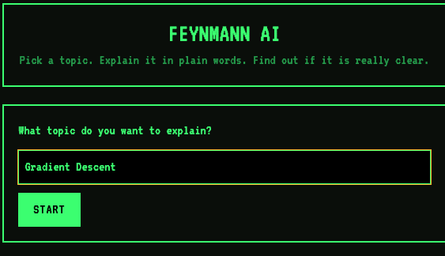
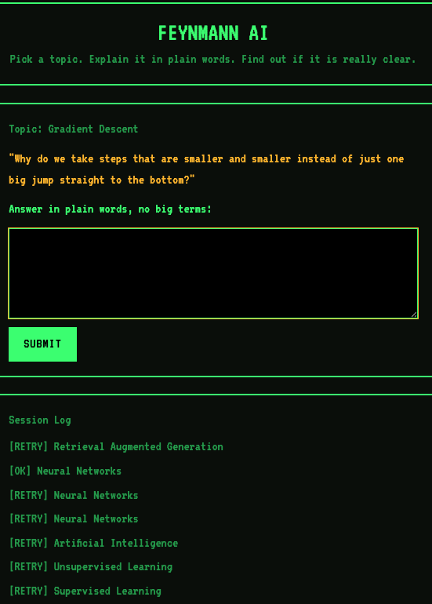
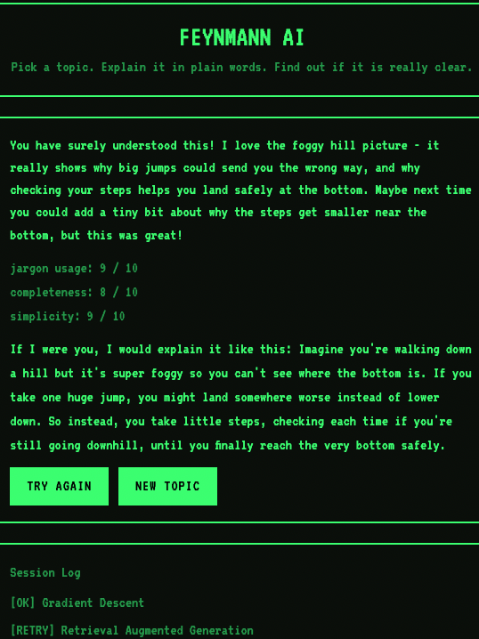

# FEYNMANN AI

## Description

An AI-powered Feynman Technique practice tool. The user picks a topic; the AI responds
like a curious child asking a narrow, specific question about it (e.g. "hey, could you
explain this part to me?"). The user answers in plain language, avoiding jargon and
complex vocabulary. The AI grades the explanation against a rubric and returns:

- A verdict + feedback in the voice of a curious child, in one of two tones: an
  encouraging "You have surely understood this" or a constructive "Unfortunately this
  isn't crystal clear yet, you should work on this a bit" — plus the specific rubric
  feedback backing that verdict.
- Its own plain-language model answer to the question it asked, opening with
  "If I were you, I would explain it like this:" — so the user has a reference for what
  a clear explanation looks like.

## Screenshots

<!-- Drop screenshots into screenshots/ and they'll render below. -->

| Topic screen | Question / answer screen | Result screen |
| --- | --- | --- |
|  |  |  |

### Scoring

Rubric-based, multiple dimensions combined into one overall verdict:
- **Jargon usage** — did the user lean on technical terms instead of plain language?
- **Completeness** — does the explanation actually answer the AI's question?
- **Simplicity** — could a non-expert (or a child) follow it?

Each dimension gets a 0-10 score; `understood` is only `true` when all three are 7+.

### State

No database, and no server-side session state. Each request is stateless on the backend.
Any history of past attempts/topics is kept client-side only (in-memory or
localStorage) — nothing survives a page reload beyond what the browser holds.

## Design Language

70s/80s retro. Avoid unnecessary animations — keep it minimal and manual, as if this
app were built on 80s-era machines. Implemented as: black background, green terminal
text, amber accent, VT323 monospace font, thick borders, no rounded corners, no
transitions/animations.

## Frameworks

- Backend files live in `backend/`, frontend files live in `frontend/`.
- Backend: FastAPI, Pydantic, Python.
  - `POST /api/question` — takes a topic, returns the AI's curious-child question.
  - `POST /api/evaluate` — takes topic + question + explanation, returns the rubric
    scores, verdict, feedback, and model explanation.
- Frontend: Next.js (App Router, TypeScript, Tailwind).
  - `app/page.tsx` drives the topic → question → result flow.
  - `lib/api.ts` calls the backend, `lib/history.ts` reads/writes the localStorage log,
    `lib/types.ts` mirrors the backend Pydantic schemas.
- No database — see State above.

## AI

- Provider: Anthropic API, Claude Sonnet 5.
- Target cost: ~$0.10 max per call.
- Guardrails, enforced two ways:
  1. **Hard token caps** — small `max_tokens` on the completion, and a capped input
     length passed to the model (Pydantic `max_length` on request fields).
  2. **Pre-flight length check** — backend rejects oversized requests with a friendly
     error before ever calling the API, instead of relying on the API call itself to
     fail or overrun cost.
- System prompt: written as a single, tightly structured prompt per endpoint (topic
  question style, scoring rubric, response tone) rather than assembled from free-form
  pieces. Lives in `backend/app/prompts.py`.
- Validation: Pydantic schemas (`backend/app/schemas.py`) validate both directions —
  - user request (topic, explanation text) before it's sent to the model,
  - the model's response (rubric scores + verdict + feedback + model explanation)
    before it's returned to the frontend, so a malformed/hallucinated model response
    can't leak through.
- `.env.example` documents required env vars (API key, model name) — no real secrets
  committed; `.env` is gitignored.

## Running locally

- Backend: `cd backend && ./.venv/bin/uvicorn app.main:app --port 8000`
- Frontend: `cd frontend && npm run dev` (defaults to `http://localhost:8000` for the
  API — override with `NEXT_PUBLIC_API_BASE_URL`, see `.env.local.example`)
